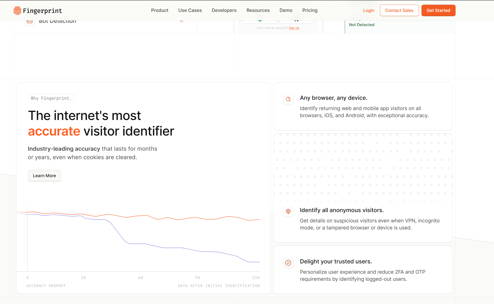

# Spotter AI Web

## 🚀 Project Structure

Inside of your Astro project, you'll see the following folders and files:

```text
/
├── public/
├── src/
│   └── pages/
│       └── index.astro
└── package.json
```

## 🧞 Commands

All commands are run from the root of the project, from a terminal:

| Command                   | Action                                           |
| :------------------------ | :----------------------------------------------- |
| `pnpm install`             | Installs dependencies                            |
| `pnpm dev`             | Starts local dev server at `localhost:4321`      |
| `pnpm build`           | Build your production site to `./dist/`          |
| `pnpm preview`         | Preview your build locally, before deploying     |


## 👀 Test Guide

### Task

Clone this UI modal of fingerprint.com but with branding from spotter.ai . Please attach your github code and also send us a hosted version via https://vercel.com/ .




